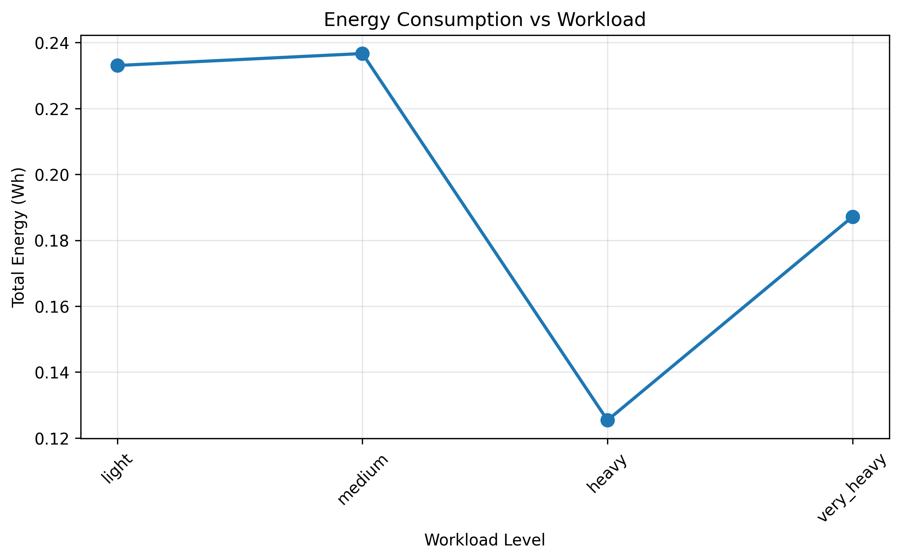

# Battery-Aware Offloading Thesis Validation Report

**Generated:** 2025-09-16 10:13:37
**Runs Analyzed:** 120
**Strict Mode:** No

## Executive Summary

| Validation Point | Status | Summary |
|------------------|--------|---------|
| Threshold 30Pct | PASS | OK |
| Nav Slam Local | PASS | OK |
| Local Edge Tradeoff | FAIL | OK |
| Workload Stability | FAIL | 1 issues |
| Task Type Impact | PASS | OK |
| Soc Curve | PASS | 0 violations |
| Deadline Miss | PASS | OK |

---

## Threshold 30Pct

**Status:** PASS
**Total Violations:** 0

### SoC > 30% Distribution (GENERIC tasks should avoid CLOUD)

| Run | Total | Local | Edge | Cloud | Violations |
|-----|-------|-------|------|-------|------------|
| above_35pct | 73 | 32 | 41 | 0 | 0 |
| high_45pct | 71 | 36 | 35 | 0 | 0 |
| crossing_threshold_33pct | 54 | 31 | 23 | 0 | 0 |
| just_above_32pct | 39 | 24 | 15 | 0 | 0 |
| heavy_edge_heavy | 145 | 25 | 120 | 0 | 0 |
| light_local_heavy | 135 | 114 | 21 | 0 | 0 |
| very_heavy_balanced | 130 | 66 | 64 | 0 | 0 |
| slam_intensive | 122 | 66 | 56 | 0 | 0 |
| light_edge_heavy | 131 | 30 | 101 | 0 | 0 |
| medium_edge_heavy | 136 | 29 | 107 | 0 | 0 |
| heavy_balanced | 144 | 71 | 73 | 0 | 0 |
| medium_local_heavy | 139 | 110 | 29 | 0 | 0 |
| medium_balanced | 141 | 78 | 63 | 0 | 0 |
| nav_intensive | 102 | 54 | 48 | 0 | 0 |
| light_balanced | 131 | 64 | 67 | 0 | 0 |
| generic_only | 200 | 105 | 95 | 0 | 0 |
| above_35pct | 91 | 43 | 48 | 0 | 0 |
| high_45pct | 100 | 54 | 46 | 0 | 0 |
| crossing_threshold_33pct | 54 | 31 | 23 | 0 | 0 |
| just_above_32pct | 39 | 24 | 15 | 0 | 0 |
| heavy_edge_heavy | 145 | 25 | 120 | 0 | 0 |
| light_local_heavy | 135 | 114 | 21 | 0 | 0 |
| very_heavy_balanced | 130 | 66 | 64 | 0 | 0 |
| slam_intensive | 122 | 66 | 56 | 0 | 0 |
| light_edge_heavy | 131 | 30 | 101 | 0 | 0 |
| medium_edge_heavy | 136 | 29 | 107 | 0 | 0 |
| heavy_balanced | 144 | 71 | 73 | 0 | 0 |
| medium_local_heavy | 139 | 110 | 29 | 0 | 0 |
| medium_balanced | 141 | 78 | 63 | 0 | 0 |
| nav_intensive | 102 | 54 | 48 | 0 | 0 |
| light_balanced | 131 | 64 | 67 | 0 | 0 |
| generic_only | 200 | 105 | 95 | 0 | 0 |
| edge_40ms | 135 | 73 | 62 | 0 | 0 |
| edge_10ms | 131 | 64 | 67 | 0 | 0 |
| edge_20ms | 131 | 68 | 63 | 0 | 0 |
| edge_80ms | 141 | 78 | 63 | 0 | 0 |
| edge_40ms | 135 | 73 | 62 | 0 | 0 |
| edge_10ms | 131 | 64 | 67 | 0 | 0 |
| edge_20ms | 131 | 68 | 63 | 0 | 0 |
| edge_80ms | 141 | 78 | 63 | 0 | 0 |
| results | 143 | 68 | 75 | 0 | 0 |
| results | 141 | 70 | 71 | 0 | 0 |
| heavy_edge_heavy | 145 | 25 | 120 | 0 | 0 |
| light_local_heavy | 135 | 114 | 21 | 0 | 0 |
| very_heavy_balanced | 130 | 66 | 64 | 0 | 0 |
| slam_intensive | 122 | 66 | 56 | 0 | 0 |
| light_edge_heavy | 131 | 30 | 101 | 0 | 0 |
| medium_edge_heavy | 136 | 29 | 107 | 0 | 0 |
| heavy_balanced | 144 | 71 | 73 | 0 | 0 |
| medium_local_heavy | 139 | 110 | 29 | 0 | 0 |
| medium_balanced | 141 | 78 | 63 | 0 | 0 |
| nav_intensive | 102 | 54 | 48 | 0 | 0 |
| light_balanced | 131 | 64 | 67 | 0 | 0 |
| generic_only | 200 | 105 | 95 | 0 | 0 |
| results | 143 | 68 | 75 | 0 | 0 |
| results | 73 | 37 | 36 | 0 | 0 |
| edge_40ms | 135 | 73 | 62 | 0 | 0 |
| edge_10ms | 131 | 64 | 67 | 0 | 0 |
| edge_20ms | 131 | 68 | 63 | 0 | 0 |
| edge_80ms | 141 | 78 | 63 | 0 | 0 |
| heavy_edge_heavy | 145 | 25 | 120 | 0 | 0 |
| light_local_heavy | 135 | 114 | 21 | 0 | 0 |
| very_heavy_balanced | 130 | 66 | 64 | 0 | 0 |
| slam_intensive | 122 | 66 | 56 | 0 | 0 |
| light_edge_heavy | 131 | 30 | 101 | 0 | 0 |
| medium_edge_heavy | 136 | 29 | 107 | 0 | 0 |
| heavy_balanced | 144 | 71 | 73 | 0 | 0 |
| medium_local_heavy | 139 | 110 | 29 | 0 | 0 |
| medium_balanced | 141 | 78 | 63 | 0 | 0 |
| nav_intensive | 102 | 54 | 48 | 0 | 0 |
| light_balanced | 131 | 64 | 67 | 0 | 0 |
| generic_only | 200 | 105 | 95 | 0 | 0 |
| results | 141 | 70 | 71 | 0 | 0 |
| results | 141 | 70 | 71 | 0 | 0 |
| results | 37 | 18 | 19 | 0 | 0 |
| edge_40ms | 135 | 73 | 62 | 0 | 0 |
| edge_10ms | 131 | 64 | 67 | 0 | 0 |
| edge_20ms | 131 | 68 | 63 | 0 | 0 |
| edge_80ms | 141 | 78 | 63 | 0 | 0 |
| edge_40ms | 135 | 73 | 62 | 0 | 0 |
| edge_10ms | 131 | 64 | 67 | 0 | 0 |
| edge_20ms | 131 | 68 | 63 | 0 | 0 |
| edge_80ms | 141 | 78 | 63 | 0 | 0 |
| above_35pct | 73 | 32 | 41 | 0 | 0 |
| high_45pct | 71 | 36 | 35 | 0 | 0 |
| crossing_threshold_33pct | 54 | 31 | 23 | 0 | 0 |
| just_above_32pct | 39 | 24 | 15 | 0 | 0 |
| results | 141 | 70 | 71 | 0 | 0 |
| results | 141 | 70 | 71 | 0 | 0 |
| heavy_edge_heavy | 145 | 25 | 120 | 0 | 0 |
| light_local_heavy | 135 | 114 | 21 | 0 | 0 |
| very_heavy_balanced | 130 | 66 | 64 | 0 | 0 |
| slam_intensive | 122 | 66 | 56 | 0 | 0 |
| light_edge_heavy | 131 | 30 | 101 | 0 | 0 |
| medium_edge_heavy | 136 | 29 | 107 | 0 | 0 |
| heavy_balanced | 144 | 71 | 73 | 0 | 0 |
| medium_local_heavy | 139 | 110 | 29 | 0 | 0 |
| medium_balanced | 141 | 78 | 63 | 0 | 0 |
| nav_intensive | 102 | 54 | 48 | 0 | 0 |
| light_balanced | 131 | 64 | 67 | 0 | 0 |
| generic_only | 200 | 105 | 95 | 0 | 0 |
| results | 37 | 18 | 19 | 0 | 0 |

### SoC ≤ 30% Distribution (GENERIC tasks MUST use CLOUD)

| Run | Total | Local | Edge | Cloud | Violations |
|-----|-------|-------|------|-------|------------|
| critical_15pct | 69 | 0 | 0 | 69 | 0 |
| exactly_30pct | 75 | 0 | 0 | 75 | 0 |
| very_low_20pct | 81 | 0 | 0 | 81 | 0 |
| low_25pct | 85 | 0 | 0 | 85 | 0 |
| crossing_threshold_33pct | 15 | 0 | 0 | 15 | 0 |
| just_below_28pct | 67 | 0 | 0 | 67 | 0 |
| just_above_32pct | 38 | 0 | 0 | 38 | 0 |
| results | 76 | 0 | 0 | 76 | 0 |
| results | 76 | 0 | 0 | 76 | 0 |
| critical_15pct | 97 | 0 | 0 | 97 | 0 |
| exactly_30pct | 96 | 0 | 0 | 96 | 0 |
| very_low_20pct | 108 | 0 | 0 | 108 | 0 |
| low_25pct | 116 | 0 | 0 | 116 | 0 |
| crossing_threshold_33pct | 41 | 0 | 0 | 41 | 0 |
| just_below_28pct | 98 | 0 | 0 | 98 | 0 |
| just_above_32pct | 55 | 0 | 0 | 55 | 0 |
| results | 67 | 0 | 0 | 67 | 0 |
| critical_15pct | 69 | 0 | 0 | 69 | 0 |
| exactly_30pct | 75 | 0 | 0 | 75 | 0 |
| very_low_20pct | 81 | 0 | 0 | 81 | 0 |
| low_25pct | 85 | 0 | 0 | 85 | 0 |
| crossing_threshold_33pct | 15 | 0 | 0 | 15 | 0 |
| just_below_28pct | 67 | 0 | 0 | 67 | 0 |
| just_above_32pct | 38 | 0 | 0 | 38 | 0 |

---

## Nav Slam Local

**Status:** PASS
**Total Violations:** 0
**Average Compliance:** 100.0%


---

## Local Edge Tradeoff

**Status:** FAIL

### Trade-off Analysis

| Metric | Edge Heavy | Local Heavy | Difference |
|--------|------------|-------------|------------|
| Energy (Wh) | 0.314 | 0.602 | +0.288 |
| Mean Latency (ms) | 2872.1 | 4447.9 | +1575.8 |


---

## Workload Stability

**Status:** FAIL
**Issues Found:** 1

### Stability Issues

- SoC increase: medium→heavy




---

## Task Type Impact

**Status:** PASS
**Scenarios Analyzed:** 3

### Task Type Impact Analysis

| Scenario | Local Ratio | Energy (Wh) | Latency (ms) |
|----------|-------------|-------------|--------------|
| slam_intensive | 0.72 | 0.531 | 4118.8 |
| nav_intensive | 0.76 | 0.560 | 4306.9 |
| generic_only | 0.53 | 0.416 | 3443.6 |

---

## Soc Curve

**Status:** PASS
**Violations:** 0


---

## Deadline Miss

**Status:**  ANALYZED (Limitation Study)
**Average Miss Rate:** 0.741
**Maximum Miss Rate:** 0.840

**Assessment:** High miss rate indicates need for dynamic/multi-objective optimization


---

## Reproduction Commands

### Windows PowerShell

```powershell
# Run baseline experiment
.\scripts\run_baseline.ps1

# Run low battery validation
.\scripts\run_low_battery_test.ps1

# Run this validation
$env:PYTHONPATH="src"
python tools\validate_thesis_claims.py --roots results extracted_results --out-dir tools\validation_out
```

### macOS/Linux

```bash
# Run baseline experiment
./scripts/run_baseline.sh

# Run low battery validation (adapt PowerShell script)

# Run this validation
export PYTHONPATH=src
python tools/validate_thesis_claims.py --roots results extracted_results --out-dir tools/validation_out
```
